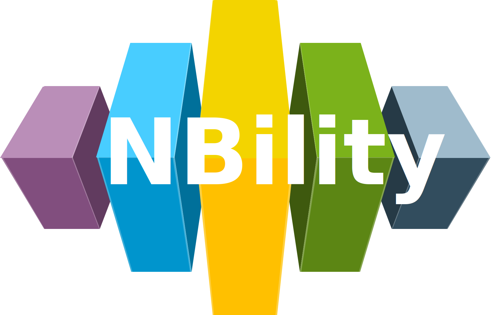

# NBility

NBility is a capability model for a grid operator. It has been created to simplify working together within the utility sector and with the suppliers/advisors of the grid operators. The NBilty model exists of a capability model, a related business object model and a value stream model. A PowerPoint version of the model in English is available here: [**NBility Model 2.3 – English**](https://www.edsn.nl/wp-content/uploads/2025/02/NBility-Model-2.3-English.pptx). In the Excel file above, the capabilities are described in English (column F).

## Viewing the Model

You can view the NBility model without needing to install Archi by following this link: [View NBility Model](/model).

## Additional Information

For more details on the NBility model, please explore the following resources:

* [NBility on Github](https://github.com/NBility-Model)
* Watch the recording of our introductory webinar (held on September, 2024): [Webinar NBility September, 2024 (YouTube)](https://www.youtube.com/watch?v=Vv1gV4KiHbY) (English)
