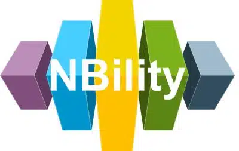

# NBility

NBility is a comprehensive capability model designed for grid operators. It was developed to streamline collaboration within the utility sector and with the suppliers and advisors of grid operators. The NBility model comprises three key components:

* A capability model
* A related object model
* A value stream model

The NBility model is actively maintained by the Dutch Distribution System Operators. Additionally, a User Group is being established to facilitate the exchange of experiences among users and to gather suggestions for future improvements.

## Viewing the Model

You can view the NBility model without needing to install Archi by following this link: [View NBility Model](/model).

## Additional Information

For more details on the NBility model, please explore the following resources:

* [NBility on Github](https://github.com/NBility-Model)
* Watch the recording of our introductory webinar (held on September, 2024): [Webinar NBility September, 2024 (YouTube)](https://www.youtube.com/watch?v=Vv1gV4KiHbY) (English)
